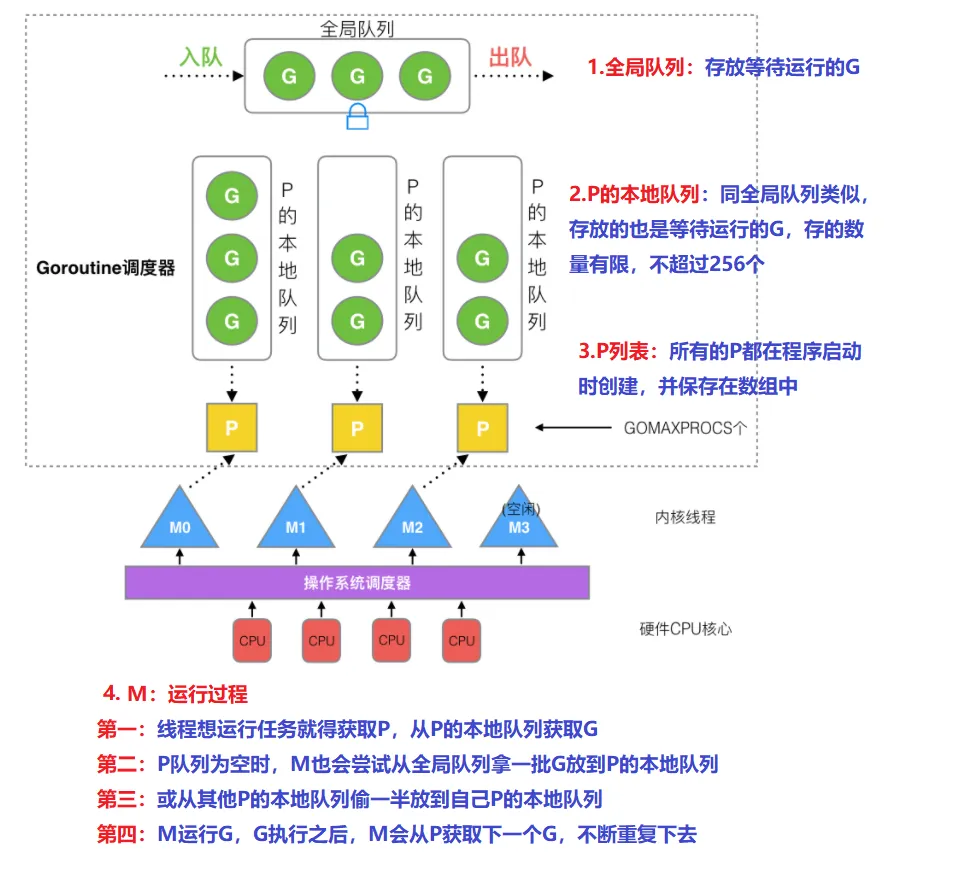
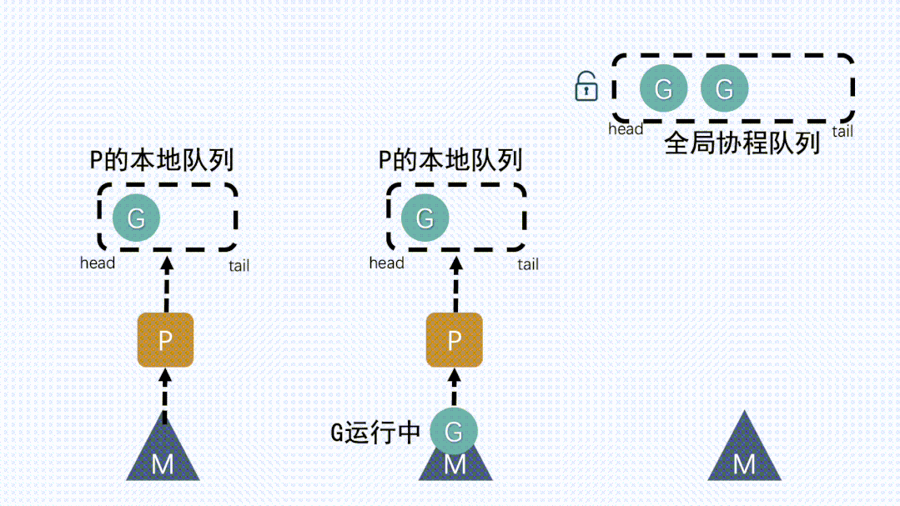

# 深入探讨Go语言协程调度：GRM模型解析与优化策略

# 深入探讨Go语言协程调度：GRM模型解析与优化策略

# 调度器 GMP 模型
1. G：goroutine（协程）

2. M：thread（内核线程，不是用户态线程）

3. P：processer（调度器）

### GM 模型

* G（协程）通常在代码里用 go 关键字执行一个方法，那么就等于起了一个 G

* M（内核线程）操作系统内核其实看不见 G 和 P，只知道自己在执行一个线程

* G 和 P 都是在用户层上的实现

* 并发量小的时候还好，当并发量大了，这把大锁，就成了性能瓶颈

* GMP 由来
	* 基于没有什么是加一个中间层不能解决的思路，golang在原有的GM的基础上加入了一个调度器P
	* 可以简单理解为是在G和M中间加了个中间层
	* 于是就有了现在的GMP模型里的P

### GMP 模型

### GMP流程分析 

* 我们通过go func()来创建一个goroutine

1、 P本地队列获取G

*  M想要运行G，就要先获取P，然后从P的本地队列获取G

2、本地队列中G移动到全局队列
*  新建G时，新G会优先加入到P的本地队列
*  如果本地队列满了，则会把本地队列中一半的G移动到全局队列

3、从其他P本地队列的G放到自己P队列
* 如果全局队列为空时，M会从其他P的本地队列偷（stealing）一半G放到自己P的本地队列

4、M从P获取下一个G，不断重复

* M运行G，G执行之后，M会从P获取下一个G，不断重复下去

